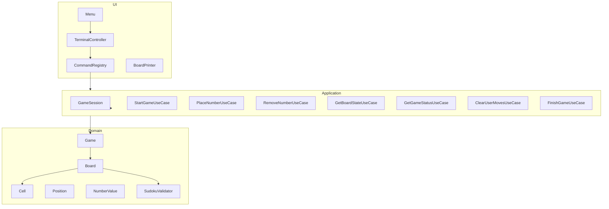

Sudoku Game


Projeto desenvolvido como exercício de bootcamp com o objetivo de implementar um jogo de Sudoku executado via terminal, onde aproveitei para praticar boas práticas de arquitetura, testes unitários, padrões de projeto e diferentes estratégias de validação.

O projeto evoluiu além do requisito inicial e foi estruturado com foco em:

- Separação clara de responsabilidades
- Arquitetura orientada a casos de uso
- Estratégias de validação intercambiáveis
- Testabilidade
- Extensibilidade


## Como Executar
```bash

# instalar dependências do maven
mvn clean install


# iniciar com um mapa inicial via argumento
mvn compile exec:java \
    -Dexec.mainClass="com.rafaelocunha.sudoku.app.SudokuApplication" \
    -Dexec.args="0,0,5;0,1,3;0,4,7;1,0,6;1,3,1;1,4,9;1,5,5;2,1,9;2,2,8;2,7,6"

```

formato do mapa:
- `row,col,value;row,col,value;...`
- `0,0,5;0,1,3;1,0,6`


## Funcionalidades

1 - Start Game
2 - Place Number
3 - Remove Number
4 - Show Board
5 - Show Status
6 - Clear Moves
7 - Finish Game
0 - Exit

## Arquitetura

domain/      → Regras de negócio puras
usecase/     → Casos de uso da aplicação
ui/terminal/ → Interface via terminal
app/         → Inicialização e wiring


## Conceitos aplicados

- Clean Architecture (inspirado)
    - Separação entre domínio, aplicação e interface.
- Command Pattern
    - Menu desacoplado da execução.
- Strategy Pattern
    - Múltiplas implementações de SudokuValidator: imperativo, Stream/Lambda, Paralelo 
- Value Objects
    - Position e NumberValue
- Imutabilidade parcial
    - Células fixas não podem ser alteradas.
- DTOs
    - Board state e CellState
- Testes Unitários
    - Domain
    - Services
    - Use Cases

## Testes
CObertura inclui:
- Value Objects
- Regras de domínio
- Fluxo de jogo
- Casos de uso

```bash
# executar dentro da pasta do projeto (sudoku)
mvn test
```

## Tecnologias usadas no projeto
- Java 17
- Maven
- JUnit 5
- ExecutorService (Java Concurrency API)
- Stream API

## Possíveis Melhorias
- Implementar validador incremental O(1)
- Implementar solver automático
- Adicionar modo rascunho (draft mode)
- Interface gráfica (Swing / JavaFX / Web)
- Benchmark entre validadores
- Persistência de jogos
- Modo multiplayer local
- Logs estruturados
- Uso de mapas em arquivos com modos de dificuldade.


## Infraestrutura e Ambiente de Desenvolvimento

- Reprodutibilidade
- Independência do sistema operacional
- Padronização de ferramentas
- Execução consistente de testes

### Docker
- Base utilizada `Eclipse Temurin JDK 17`
- Ferramentas Instaladas no Container
    - Java 17`
    - Maven`
    - Git`
    - Curl`
    - Unzip`
    - Vim`
    - Tree`

### Automação com Makefile

Comandos disponíveis
```bash
# Construir imagem 
make build

# Acessar container interativo 
make shell

# Rodar testes
make run

# Executar container em background
make detached

# Parar container
make stop

# Rebuild sem cache
make rebuild

# Remover imagem
make clean

```


## Diagrama de arquitetura do projeto

## 🏗 Arquitetura do Projeto

