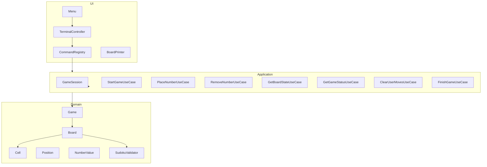

<p align="center">
  <h1>
    Sudoku Game
  </h1>
</p>

<div style="display: flex; align-items: center; padding: 10px;">
  <span>
    <a href="https://github.com/rafael-o-cunha/">
        
    </a>
</span>
</div>

---

<div style="display: flex; align-items: center; padding: 10px;">
  <span>
    <a href="https://github.com/rafael-o-cunha/JavaPractice/tree/sudoku/README.md">
      
    </a>
  </span>

  <span>
    <a href="https://github.com/rafael-o-cunha/JavaPractice/tree/sudoku/README_EN.md">
      
    </a>
  </span>

  <span>
    <a href="https://github.com/rafael-o-cunha/JavaPractice/tree/sudoku/README_ES.md">
      
    </a>
  </span>
</div>

---


## Overview

This project was developed as a bootcamp exercise with the goal of implementing a Sudoku game that runs via the terminal. I took the opportunity to practice good architectural practices, unit testing, design patterns, and different validation strategies.

The project evolved beyond the initial requirement and was structured focusing on:

- Clear separation of responsibilities
- Use case-driven architecture
- Interchangeable validation strategies
- Testability
- Extensibility

### The project requirements can be found at: 

## How to Run
```bash

# install maven dependencies
mvn clean install


# Start with an initial map via argument.
mvn compile exec:java \
    -Dexec.mainClass="com.rafaelocunha.sudoku.app.SudokuApplication" \
    -Dexec.args="0,0,5;0,1,3;0,4,7;1,0,6;1,3,1;1,4,9;1,5,5;2,1,9;2,2,8;2,7,6"

```

map format:
- `row,col,value;row,col,value;...`
- `0,0,5;0,1,3;1,0,6`


## Features

- Start Game
- Place Number
- Remove Number
- Show Board
- Show Status
- Clear Moves
- Finish Game
- Exit

## Architecture
```bash
domain/      → Pure business rules
usecase/     → Application use cases
ui/terminal/ → Terminal interface
app/         → Initialization and wiring
```

## Applied concepts
- Clean Architecture (inspired)
    - Separation between domain, application, and interface.
- Command Pattern
    - Menu decoupled from execution.
- Strategy Pattern
    - Multiple SudokuValidator implementations: imperative, Stream/Lambda, Parallel
- Value Objects
    - Position and NumberValue
- Partial immutability
    - Fixed cells cannot be changed.
- DTOs
    - Board state and CellState
- Unit Tests
    - Domain
    - Services
    - Use Cases

## Tests
Coverage includes:
- Value Objects
- Domain Rules
- Game Flow
- Use Cases

```bash
# run inside the project folder (sudoku)
mvn test
```

## Technologies used in the project
- Java 17
- Maven
- JUnit 5
- ExecutorService (Java Concurrency API)
- Stream API

## Possible Improvements
- Implement incremental O(1) validator
- Implement automatic solver
- Add draft mode
- Graphical interface (Swing / JavaFX / Web)
- Benchmark between validators
- Game persistence
- Local multiplayer mode
- Structured logs
- Use of maps in files with difficulty modes.


## Infrastructure and Development Environment

- Reproducibility
- Operating system independence
- Standardization of tools
- Consistent test execution

### Docker
Base used `Eclipse Temurin JDK 17`
- Tools Installed in the Container
    - Java 17`
    - Maven`
    - Git`
    - Curl`
    - Unzip`
    - Vim`
    - Tree`

### Automation with Makefile

Available commands
```bash
# Build image
make build

# Access interactive container
make shell

# Run tests
make run

# Run container in background
make detached

# Stop container
make stop

# Rebuild without cache
make rebuild

# Remove image
make clean

```

## Project architecture diagram



