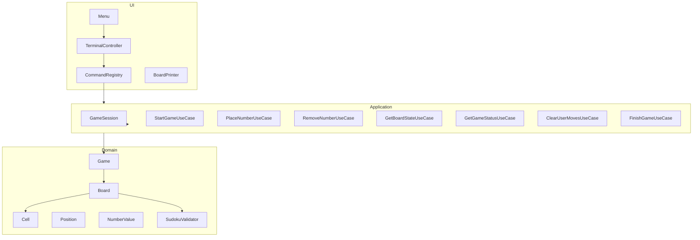

<p align="center">
  <h1>
    Sudoku Game
  </h1>
</p>

<div style="display: flex; align-items: center; padding: 10px;">
  <span>
    <a href="https://github.com/rafael-o-cunha/">
        
    </a>
</span>
</div>

---

<div style="display: flex; align-items: center; padding: 10px;">
  <span>
    <a href="https://github.com/rafael-o-cunha/JavaPractice/tree/sudoku/README.md">
      
    </a>
  </span>

  <span>
    <a href="https://github.com/rafael-o-cunha/JavaPractice/tree/sudoku/README_EN.md">
      
    </a>
  </span>

  <span>
    <a href="https://github.com/rafael-o-cunha/JavaPractice/tree/sudoku/README_ES.md">
      
    </a>
  </span>
</div>

---


## Descripción general

Este proyecto se desarrolló como un bootcamp con el objetivo de implementar un juego de Sudoku que se ejecuta mediante la terminal. Aproveché la oportunidad para practicar buenas prácticas de arquitectura, pruebas unitarias, patrones de diseño y diferentes estrategias de validación.

El proyecto evolucionó más allá del requerimiento inicial y se estructuró centrándose en:

- Clara separación de responsabilidades
- Arquitectura basada en casos de uso
- Estrategias de validación intercambiables
- Capacidad de prueba
- Extensibilidad


## Cómo correr
```bash

# instalar dependencias de maven
mvn clean install


# Comience con un mapa inicial a través de un argumento.
mvn compile exec:java \
    -Dexec.mainClass="com.rafaelocunha.sudoku.app.SudokuApplication" \
    -Dexec.args="0,0,5;0,1,3;0,4,7;1,0,6;1,3,1;1,4,9;1,5,5;2,1,9;2,2,8;2,7,6"

```

map format:
- `row,col,value;row,col,value;...`
- `0,0,5;0,1,3;1,0,6`


## Características

- Iniciar partida
- Colocar número
- Quitar número
- Mostrar tablero
- Mostrar estado
- Borrar jugadas
- Finalizar partida
- Salir

## Arquitectura
```bash
domain/      → Reglas de negocio puras
usecase/     → Casos de uso de aplicaciones
ui/terminal/ → Interfaz de terminal
app/         → Inicialización y cableado
```

## Conceptos aplicados
- Arquitectura limpia (inspirada)
    - Separación entre dominio, aplicación e interfaz.
- Patrón de comandos
    - Menú desacoplado de la ejecución.
- Patrón de estrategia
    - Múltiples implementaciones de SudokuValidator: imperativo, Stream/Lambda, paralelo.
- Objetos de valor
    - Posición y valor numérico
- Inmutabilidad parcial
    - Las celdas fijas no se pueden modificar.
- DTO
    - Estado de la placa y estado de celda
- Pruebas unitarias
    - Dominio
    - Servicios
    - Casos de uso

## Pruebas
La cobertura incluye:
- Objetos de valor
- Reglas del dominio
- Flujo del juego
- Casos de uso

```bash
# ejecutar dentro de la carpeta del proyecto (sudoku)
mvn test
```

## Tecnologías utilizadas en el proyecto
- Java 17
- Maven
- JUnit 5
- ExecutorService (Java Concurrency API)
- Stream API

## Posibles mejoras
- Implementar un validador incremental O(1)
- Implementar un solucionador automático
- Añadir modo borrador
- Interfaz gráfica (Swing / JavaFX / Web)
- Comparación entre validadores
- Persistencia del juego
- Modo multijugador local
- Registros estructurados
- Uso de mapas en archivos con diferentes niveles de dificultad.

## Entorno de infraestructura y desarrollo

- Reproducibilidad
- Independencia del sistema operativo
- Estandarización de herramientas
- Ejecución consistente de pruebas

### Docker
Base utilizada `Eclipse Temurin JDK 17`
- Herramientas instaladas en el contenedor
    - Java 17`
    - Maven`
    - Git`
    - Curl`
    - Unzip`
    - Vim`
    - Tree`

### Automatización con Makefile

Comandos disponibles
```bash
# Construir imagen
make build

# Acceder al contenedor interactivo
make shell

# Ejecutar pruebas
make run

# Ejecutar el contenedor en segundo plano
make detached

# Detener el contenedor
make stop

# Reconstruir sin caché
make rebuild

# Eliminar imagen
make clean

```

## Diagrama de arquitectura del proyecto.



